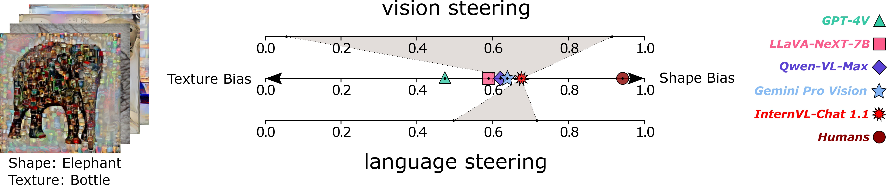

# Can We Talk Models Into Seeing the World Differently? (ICLR 2025)
Paul Gavrikov, Jovita Lukasik, Steffen Jung, Robert Geirhos, Muhammad Jehanzeb Mirza, Margret Keuper, Janis Keuper

This paper is based on "Are Vision Language Models Texture or Shape Biased and Can We Steer Them?", previously presented at the MMFM Workshop @ CVPR 2024.

[![CC BY-SA 4.0][cc-by-sa-shield]][cc-by-sa]

[Paper](https://openreview.net/forum?id=iVMcYxTiVM) | [ArXiv](https://arxiv.org/abs/2403.09193)


Abstract: *Unlike traditional vision-only models, vision language models (VLMs) offer an intuitive way to access visual content through language prompting by combining a large language model (LLM) with a vision encoder. However, both the LLM and the vision encoder come with their own set of biases, cue preferences, and shortcuts, which have been rigorously studied in uni-modal models. A timely question is how such (potentially misaligned) biases and cue preferences behave under multi-modal fusion in VLMs. As a first step towards a better understanding, we investigate a particularly well-studied vision-only bias - the texture vs. shape bias and the dominance of local over global information. As expected, we find that VLMs inherit this bias to some extent from their vision encoders. Surprisingly, the multi-modality alone proves to have important effects on the model behavior, i.e., the joint training and the language querying change the way visual cues are processed. While this direct impact of language-informed training on a model's visual perception is intriguing, it raises further questions on our ability to actively steer a model's output so that its prediction is based on particular visual cues of the user's choice. Interestingly, VLMs have an inherent tendency to recognize objects based on shape information, which is different from what a plain vision encoder would do. Further active steering towards shape-based classifications through language prompts is however limited. In contrast, active VLM steering towards texture-based decisions through simple natural language prompts is often more successful.*

[cc-by-sa]: http://creativecommons.org/licenses/by-sa/4.0/
[cc-by-sa-image]: https://licensebuttons.net/l/by-sa/4.0/88x31.png
[cc-by-sa-shield]: https://img.shields.io/badge/License-CC%20BY--SA%204.0-lightgrey.svg




## Reproduce our results

### Setup

Please see the instructions in ENV.md for details on how to setup the environments. You will probably need multiple environments if you want to test multiple models.

Then download the textute/shape cue-conflict dataset from [here](https://github.com/rgeirhos/texture-vs-shape/tree/master/stimuli/style-transfer-preprocessed-512) to your system. 

Our new low-/high-frequency cue-conflict dataset is available at [Kaggle](https://www.kaggle.com/datasets/paulgavrikov/low-vs-high-frequency-cue-conflict/) and is directly compatible with the texture/shape bias processing (except that shape=low-frequency band and texture=high-frequency band).

### Evaluate Models

Use `eval_vlm.py` to generate responses for your selected model. Note that this script does not perform any classification, it just prompts a model for all images and stores the output as a CSV. For example:
```bash
cd code
python eval_vlm.py --prompt "Which option best describes the image?\nA. airplane\nB. bear\nC. bicycle\nD. bird\nE. boat\nF. bottle\nG. car\nH. cat\nI. chair\nJ. clock\nK. dog\nL. elephant\nM. keyboard\nN. knife\nO. oven\nP. truck\nAnswer with the option's letter from the given choices directly." --output-path "../raw-data/vlm/vqa/" --model "llava_1_6_vicuna_7b" --img-path "./datasets/stimuli/texture-shape-cue-conflict/"
```
Then you can use the classification scripts `clf_vqa.py` (if you used the VQA prompt) or `clf_caption.py` (if you used the captioning prompt) to perform the classification. You can run both scripts on entire folders or individual files. This will modify the log with the classification result and generate another CSV containing a summary of all measurements including shape bias. For example:
```bash
python clf_vqa.py --file-dir ../raw-data/vqa/yyyyymmdd_hhmmss_your_vlm.csv
```

Once classified, you can also use `shapebias_utils.py` to directly evaluate log files. To annotate caption logs with an LLM as described in our paper, use `llm_judge.py`.

#### Prompts

| Type | Prompt |
|---|---|
| Captioning | Describe the image. Keep your response short. |
| VQA | Which option best describes the image?\nA. airplane\nB. bear\nC. bicycle\nD. bird\nE. boat\nF. bottle\nG. car\nH. cat\nI. chair\nJ. clock\nK. dog\nL. elephant\nM. keyboard\nN. knife\nO. oven\nP. truck\nAnswer with the option's letter from the given choices directly. |
| VQA (Shape-biased) | Identify the primary shape in the image.\nA. airplane\nB. bear\nC. bicycle\nD. bird\nE. boat\nF. bottle\nG. car\nH. cat\nI. chair\nJ. clock\nK. dog\nL. elephant\nM. keyboard\nN. knife\nO. oven\nP. truck\nAnswer with the option's letter from the given choices directly. |
| VQA (Texture-biased) | Identify the primary texture in the image.\nA. airplane\nB. bear\nC. bicycle\nD. bird\nE. boat\nF. bottle\nG. car\nH. cat\nI. chair\nJ. clock\nK. dog\nL. elephant\nM. keyboard\nN. knife\nO. oven\nP. truck\nAnswer with the option's letter from the given choices directly. |


### Automated Prompt Search

To use automatically search for prompts using Mixtral, use `llm_prompt_search.py`. Note that you have to manually set the accuracy/shape-bias for the default instruction in L81. 


## Citation 

If you find our work useful in your research, please consider citing:

```
@inproceedings{gavrikov2025can,
      title={Can We Talk Models Into Seeing the World Differently?},
      author={Paul Gavrikov and Jovita Lukasik and Steffen Jung and Robert Geirhos and Muhammad Jehanzeb Mirza and Margret Keuper and Janis Keuper},
      booktitle={The Thirteenth International Conference on Learning Representations},
      year={2025},
      url={https://openreview.net/forum?id=iVMcYxTiVM}
}
```

### Legal
This work is licensed under a
[Creative Commons Attribution-ShareAlike 4.0 International License][cc-by-sa].